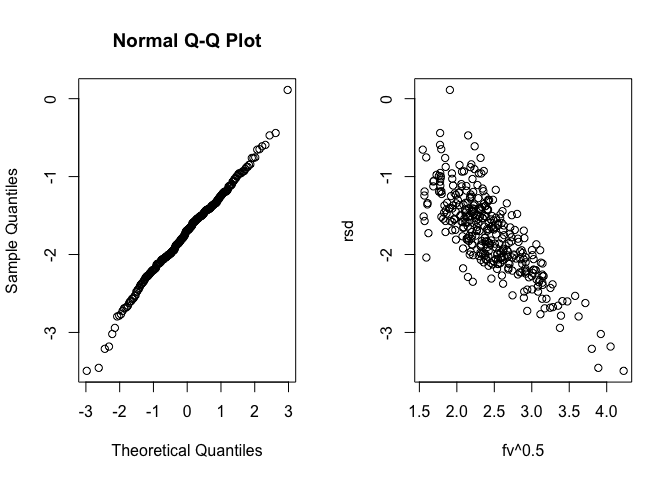

---
title:
output:
  html_document:
    keep_md: TRUE
---


## Ring-tailed lemur fecal glucocorticoids

Read in processed data


```r
library(tidyverse)
library(googlesheets4)

aggGC_full <- read_sheet("https://docs.google.com/spreadsheets/d/12EB2WXBiqfwHPIQ_2tqOvkV0i8Yzjoc5yhMlkAOtUv0/edit?usp=sharing")
```

## Targeted plots & analysis 
1. Seasonality of GC in adults:
    Do GC's change predictably with reproductive state in females (gestation, lactation, weaning, etc)
    

```r
library(gghalves)
library(lme4)
library(car)

aggGC_full %>% filter(!is.na(season), age.2wk > 150) %>% 
ggplot()+
  geom_half_boxplot(aes(x = season, y = log(mean.ngg), color = sex), side = "r")+
  geom_half_point(aes(x = season, y = log(mean.ngg), color = sex), side = "l", alpha = 0.6)+
  ggtitle("Fecal GC in RTL older than 150 weeks")+
  theme_bw()
```

<!-- -->

```r
aggGC_full.noNA <- aggGC_full %>% filter(!is.na(season))

adultSeason.lm <- lmer(log(mean.ngg)~season*sex + (1|an.id), data = aggGC_full.noNA[aggGC_full.noNA$age.2wk > 150, ])
Anova(adultSeason.lm)
```

```
## Analysis of Deviance Table (Type II Wald chisquare tests)
## 
## Response: log(mean.ngg)
##             Chisq Df Pr(>Chisq)
## season     0.3891  1     0.5327
## sex        0.3345  1     0.5630
## season:sex 0.2216  1     0.6378
```

```r
summary(adultSeason.lm)
```

```
## Linear mixed model fit by REML ['lmerMod']
## Formula: log(mean.ngg) ~ season * sex + (1 | an.id)
##    Data: aggGC_full.noNA[aggGC_full.noNA$age.2wk > 150, ]
## 
## REML criterion at convergence: 174.5
## 
## Scaled residuals: 
##      Min       1Q   Median       3Q      Max 
## -2.86860 -0.56475  0.02261  0.46662  2.43278 
## 
## Random effects:
##  Groups   Name        Variance Std.Dev.
##  an.id    (Intercept) 0.000    0.000   
##  Residual             1.226    1.107   
## Number of obs: 58, groups:  an.id, 13
## 
## Fixed effects:
##                           Estimate Std. Error t value
## (Intercept)                1.33689    0.39154   3.414
## season3-Lactation          0.36310    0.47057   0.772
## sexMale                    0.05169    0.55372   0.093
## season3-Lactation:sexMale -0.30717    0.65256  -0.471
## 
## Correlation of Fixed Effects:
##             (Intr) ssn3-L sexMal
## sesn3-Lcttn -0.832              
## sexMale     -0.707  0.588       
## ssn3-Lctt:M  0.600 -0.721 -0.849
## optimizer (nloptwrap) convergence code: 0 (OK)
## boundary (singular) fit: see ?isSingular
```

A mixed effects linear model shows only a signficant effect of sex on fecal GC's. Not of season, and there is no interaction between season & sex.

2. Aggression rates in adults across season & sex


```r
aggRc <- aggGC_full %>% filter(!is.na(season), age.2wk > 150) %>% 
ggplot()+
  geom_half_boxplot(aes(x = season, y = log(wkAggRcv.rt), color = sex), side = "r")+
  geom_half_point(aes(x = season, y = log(wkAggRcv.rt), color = sex), side = "l", alpha = 0.6)+
  theme_bw()+
  theme(legend.position = c(0.1, 0.85))

aggDt <- aggGC_full %>% filter(!is.na(season), age.2wk > 150) %>% 
ggplot()+
  geom_half_boxplot(aes(x = season, y = log(wkAggress.rt), color = sex), side = "r")+
  geom_half_point(aes(x = season, y = log(wkAggress.rt), color = sex), side = "l", alpha = 0.6)+
  theme_bw()+
    theme(legend.position = "none")

library(cowplot)
plot_grid(aggRc, aggDt, nrow = 2)
```

<!-- -->

```r
adultSeasonAggRc.lm <- lmer(wkAggRcv.rt~season*sex + (1|an.id), data = aggGC_full)
Anova(adultSeasonAggRc.lm)
```

```
## Analysis of Deviance Table (Type II Wald chisquare tests)
## 
## Response: wkAggRcv.rt
##             Chisq Df Pr(>Chisq)  
## season     7.2956  3    0.06305 .
## sex        0.8951  1    0.34409  
## season:sex 0.4403  3    0.93179  
## ---
## Signif. codes:  0 '***' 0.001 '**' 0.01 '*' 0.05 '.' 0.1 ' ' 1
```

```r
summary(adultSeasonAggRc.lm)
```

```
## Linear mixed model fit by REML ['lmerMod']
## Formula: wkAggRcv.rt ~ season * sex + (1 | an.id)
##    Data: aggGC_full
## 
## REML criterion at convergence: 3089.7
## 
## Scaled residuals: 
##     Min      1Q  Median      3Q     Max 
## -1.3112 -0.4767 -0.2469  0.1941 17.8750 
## 
## Random effects:
##  Groups   Name        Variance Std.Dev.
##  an.id    (Intercept) 0.07894  0.281   
##  Residual             1.72023  1.312   
## Number of obs: 902, groups:  an.id, 86
## 
## Fixed effects:
##                           Estimate Std. Error t value
## (Intercept)                0.51790    0.11792   4.392
## season3-Lactation          0.21550    0.13610   1.583
## season4-Weaning           -0.02726    0.21231  -0.128
## season5-Recovery           0.37957    0.20122   1.886
## sexMale                    0.18751    0.18223   1.029
## season3-Lactation:sexMale -0.13828    0.21222  -0.652
## season4-Weaning:sexMale   -0.06296    0.32740  -0.192
## season5-Recovery:sexMale  -0.06214    0.31234  -0.199
## 
## Correlation of Fixed Effects:
##             (Intr) ssn3-L ssn4-W ssn5-R sexMal s3-L:M s4-W:M
## sesn3-Lcttn -0.747                                          
## seasn4-Wnng -0.483  0.416                                   
## sesn5-Rcvry -0.514  0.443  0.286                            
## sexMale     -0.647  0.484  0.312  0.333                     
## ssn3-Lctt:M  0.479 -0.641 -0.267 -0.284 -0.748              
## ssn4-Wnng:M  0.313 -0.270 -0.648 -0.185 -0.491  0.419       
## ssn5-Rcvr:M  0.331 -0.285 -0.184 -0.644 -0.515  0.442  0.289
```

3. Fecal GC ~ Age in weeks * sex


```r
agePlot <- aggGC_full %>% dplyr::filter(age.2wk <= 150) %>%
  ggplot()+
  geom_point(aes(x = age.2wk, y = log(mean.ngg), color = sex), alpha = 0.6)+
  geom_smooth(aes(x = age.2wk, y = log(mean.ngg), color = sex))+
  theme_bw()


bplot <- aggGC_full %>% dplyr::filter(age.2wk <= 150) %>%
  ggplot()+
  geom_half_boxplot(aes(x = ageClass, y = log(mean.ngg), color = sex), side = "r")+
  geom_half_point(aes(x = ageClass, y = log(mean.ngg), color = sex), side = "l", alpha = 0.6)+
  theme_bw()

plot_grid(agePlot, bplot, nrow = 2)
```

<!-- -->


4. Aggression Received & Dealt ~ Age in weeks * sex


```r
aggPlot <- aggGC_full %>% dplyr::filter(age.2wk <= 150) %>%
  ggplot()+
  geom_point(aes(x = age.2wk, y = log(wkAggress.rt), color = sex), alpha = 0.6)+
  geom_smooth(aes(x = age.2wk, y = log(wkAggress.rt), color = sex))+
  theme_bw()

aggRcPlot <- aggGC_full %>% dplyr::filter(age.2wk <= 150) %>%
  ggplot()+
  geom_point(aes(x = age.2wk, y = log(wkAggRcv.rt), color = sex), alpha = 0.6)+
  geom_smooth(aes(x = age.2wk, y = log(wkAggRcv.rt), color = sex))+
  theme_bw()

bplot <- aggGC_full %>% dplyr::filter(age.2wk <= 150) %>%
  ggplot()+
  geom_half_boxplot(aes(x = ageClass, y = log(mean.ngg), color = sex), side = "r")+
  geom_half_point(aes(x = ageClass, y = log(mean.ngg), color = sex), side = "l", alpha = 0.6)+
  theme_bw()

plot_grid(aggPlot, aggRcPlot, nrow = 2)
```

<!-- -->

### GAMM that includes individual ID.
We'll use a Generalized Additive Mixed Effects Model. A GAM is an extensions of a linear regression that can be used for curved data. Relationships between the individual predictors and the dependent variable follow smooth patterns that can be linear or nonlinear. We can estimate these smooth relationships simultaneously and then predict **g(E(Y)))** by simply adding them up.

When your model contains nonlinear effects, GAM provides a regularized and interpretable solution – while other methods generally lack at least one of these three features. 

https://jacolienvanrij.com/Tutorials/GAMM.html#example-of-random-smooths


```r
library(mgcv)

#use only the animals that are less than 150 weeks

kids <- aggGC_full %>% filter(age.2wk <= 150)

m1 <- gamm(log(mean.ngg)~sex+s(age.2wk),
                     random = list(an.id=~1),
           correlation=corAR1(),
                     data = kids)
summary(m1$gam)
```

```
## 
## Family: gaussian 
## Link function: identity 
## 
## Formula:
## log(mean.ngg) ~ sex + s(age.2wk)
## 
## Parametric coefficients:
##             Estimate Std. Error t value Pr(>|t|)    
## (Intercept)   1.8765     0.0809  23.195  < 2e-16 ***
## sexMale      -0.3176     0.1159  -2.741  0.00647 ** 
## ---
## Signif. codes:  0 '***' 0.001 '**' 0.01 '*' 0.05 '.' 0.1 ' ' 1
## 
## Approximate significance of smooth terms:
##              edf Ref.df     F p-value    
## s(age.2wk) 6.617  6.617 7.215 4.9e-07 ***
## ---
## Signif. codes:  0 '***' 0.001 '**' 0.01 '*' 0.05 '.' 0.1 ' ' 1
## 
## R-sq.(adj) =  0.167   
##   Scale est. = 0.54597   n = 341
```

```r
anova(m1$gam)
```

```
## 
## Family: gaussian 
## Link function: identity 
## 
## Formula:
## log(mean.ngg) ~ sex + s(age.2wk)
## 
## Parametric Terms:
##     df     F p-value
## sex  1 7.511 0.00647
## 
## Approximate significance of smooth terms:
##              edf Ref.df     F p-value
## s(age.2wk) 6.617  6.617 7.215 4.9e-07
```

```r
par(mfrow=c(2,2))
gam.check(m1$gam)
```

<!-- -->

```
## 
## 'gamm' based fit - care required with interpretation.
## Checks based on working residuals may be misleading.
## Basis dimension (k) checking results. Low p-value (k-index<1) may
## indicate that k is too low, especially if edf is close to k'.
## 
##              k'  edf k-index p-value
## s(age.2wk) 9.00 6.62    0.98    0.34
```

```r
#Slightly more informative residual plots
fv <- exp(fitted(m1$lme)) ## predicted values (including re)
rsd <- (m1$gam$y - fv)/sqrt(fv) ## Pearson residuals (Poisson case)
op <- par(mfrow=c(1,2))
qqnorm(rsd);plot(fv^.5,rsd)
```

<!-- -->

```r
par(op)
```
The summary tells us that there is a significant effect of sex (p = 0.0063), and that fecal glucocorticoids change with age (F= 7.33, df = 6.671, p = 6.55e-07). This is what the `anova()` summary also tells us. Everything looks good in the diagnostic plots as well.

<br>

To plot the GAMM correctly, we need to create predicted data sets that account for the individual effects. 

```r
library(plyr)

#Create a data frame to hold the predicted data.
predDat <- ddply(kids, 
                 .(sex), 
                 summarize,
                 age.2wk = seq(min(age.2wk), max(age.2wk),length = 284))

#extract predicted values from the model & add them to the data frame
p1 <- predict(m1$gam, newdata = predDat, se = TRUE)
predDat$Fit <- p1$fit
predDat$SE  <- p1$se.fit

#Now plot it. 
ggplot()+
  geom_point(data = kids, 
             aes(x = age.2wk, 
                 y = log(mean.ngg), 
                 color = sex))+
  labs(x = "age (weeks)", y = expression(paste("fecal GC ln (ng ", g^-1, ")", sep = "")))+
  geom_line(data = predDat, 
            aes(x = age.2wk,
                y = Fit,
                color = sex))+
  geom_ribbon(data = predDat, 
                     aes(x = age.2wk, 
                         ymax = Fit + 1.96 * SE, 
                         ymin = Fit - 1.96 * SE,
                         fill = sex),
                     alpha = 0.5)+
  theme_bw()
```

<!-- -->

```r
  #facet_grid(.~sex, scales = "fixed")
```

We can do the same thing for aggression dealt & received. This isn't working quite how I want it to yet and might need to be a zero inflated model or something.


```r
kids$an.id <- as.factor(kids$an.id)
kids$sex <- as.factor(kids$sex)

#I added 1 to the values. Otherwise it freaks out with the ln(0)
m2 <- gamm(log(wkAggress.rt+1)~sex+s(age.2wk, by = sex) + s(age.2wk, an.id, bs="fs", m=1),
           family = quasipoisson(link = "log"),
           random = list(an.id=~1),
           data = kids)
```

```
## 
##  Maximum number of PQL iterations:  20
```

```r
summary(m2$gam)
```

```
## 
## Family: quasipoisson 
## Link function: log 
## 
## Formula:
## log(wkAggress.rt + 1) ~ sex + s(age.2wk, by = sex) + s(age.2wk, 
##     an.id, bs = "fs", m = 1)
## 
## Parametric coefficients:
##             Estimate Std. Error t value Pr(>|t|)    
## (Intercept) -1.54780    0.13580 -11.398   <2e-16 ***
## sexMale     -0.07399    0.19569  -0.378    0.706    
## ---
## Signif. codes:  0 '***' 0.001 '**' 0.01 '*' 0.05 '.' 0.1 ' ' 1
## 
## Approximate significance of smooth terms:
##                        edf Ref.df     F p-value
## s(age.2wk):sexFemale  1.00      1 2.106   0.148
## s(age.2wk):sexMale    1.00      1 0.003   0.954
## s(age.2wk,an.id)     20.15     NA    NA      NA
## 
## R-sq.(adj) =  0.0996   
##   Scale est. = 0.43157   n = 379
```

```r
plot(m2$gam)
```

<!-- --><!-- --><!-- -->

```r
par(mfrow = c(2,2))
gam.check(m2$gam)
```

<!-- -->

```
## 
## 'gamm' based fit - care required with interpretation.
## Checks based on working residuals may be misleading.
## Basis dimension (k) checking results. Low p-value (k-index<1) may
## indicate that k is too low, especially if edf is close to k'.
## 
##                         k'   edf k-index p-value  
## s(age.2wk):sexFemale   9.0   1.0    0.85   0.065 .
## s(age.2wk):sexMale     9.0   1.0    0.85   0.070 .
## s(age.2wk,an.id)     459.0  20.1    0.85   0.050 *
## ---
## Signif. codes:  0 '***' 0.001 '**' 0.01 '*' 0.05 '.' 0.1 ' ' 1
```
The model check on this looks terrible. Q-Q plot shows a lot of kurtosis (s-curve), and the histogram of the residuals is really skewed. May no log fit?


```r
#I added 1 to the values. Otherwise it freaks out with the ln(0)
m2a <- gamm(wkAggress.rt~sex+s(age.2wk),
                     random = list(an.id=~1),
                     data = kids)
summary(m2a$gam)
```

```
## 
## Family: gaussian 
## Link function: identity 
## 
## Formula:
## wkAggress.rt ~ sex + s(age.2wk)
## 
## Parametric coefficients:
##             Estimate Std. Error t value Pr(>|t|)    
## (Intercept)  0.37641    0.06432   5.852 1.06e-08 ***
## sexMale     -0.06941    0.09044  -0.767    0.443    
## ---
## Signif. codes:  0 '***' 0.001 '**' 0.01 '*' 0.05 '.' 0.1 ' ' 1
## 
## Approximate significance of smooth terms:
##            edf Ref.df     F p-value
## s(age.2wk)   1      1 1.285   0.258
## 
## R-sq.(adj) =  0.00375   
##   Scale est. = 0.48801   n = 379
```

```r
plot(m2a$gam)
```

<!-- -->

```r
par(mfrow = c(2,2))
gam.check(m2a$gam)
```

<!-- -->

```
## 
## 'gamm' based fit - care required with interpretation.
## Checks based on working residuals may be misleading.
## Basis dimension (k) checking results. Low p-value (k-index<1) may
## indicate that k is too low, especially if edf is close to k'.
## 
##            k' edf k-index p-value
## s(age.2wk)  9   1    0.96    0.19
```


This isn't great either.

```r
#Create a data frame to hold the predicted data.
predDat <- ddply(kids, 
                 .(sex, an.id), 
                 summarize,
                 age.2wk = seq(min(age.2wk), max(age.2wk),length = 284))

#extract predicted values from the model & add them to the data frame
p1 <- predict(m2$gam, newdata = predDat, se = TRUE)
predDat$Fit <- p1$fit
predDat$SE  <- p1$se.fit

#Now plot it. 
ggplot()+
  geom_point(data = kids, 
             aes(x = age.2wk, 
                 y = log(wkAggress.rt+1), 
                 color = sex))+
  labs(x = "age (weeks)", y = expression(paste("weekly aggression rate", sep = "")))+
  geom_line(data = predDat, 
            aes(x = age.2wk,
                y = Fit,
                color = sex))+
  geom_ribbon(data = predDat, 
                     aes(x = age.2wk, 
                         ymax = Fit + 1.96 * SE, 
                         ymin = Fit - 1.96 * SE,
                         fill = sex),
                     alpha = 0.5)+
  theme_bw()
```

<!-- -->


```r
#I added 1 to the values. Otherwise it freaks out with the ln(0)
m3 <- gamm(log(wkAggRcv.rt+1)~sex+s(age.2wk),
                     random = list(an.id=~1),
                     data = kids)
summary(m3$gam)
```

```
## 
## Family: gaussian 
## Link function: identity 
## 
## Formula:
## log(wkAggRcv.rt + 1) ~ sex + s(age.2wk)
## 
## Parametric coefficients:
##             Estimate Std. Error t value Pr(>|t|)    
## (Intercept)  0.49584    0.04079  12.157   <2e-16 ***
## sexMale     -0.08093    0.05730  -1.412    0.159    
## ---
## Signif. codes:  0 '***' 0.001 '**' 0.01 '*' 0.05 '.' 0.1 ' ' 1
## 
## Approximate significance of smooth terms:
##            edf Ref.df     F p-value
## s(age.2wk)   1      1 0.007   0.931
## 
## R-sq.(adj) =  0.00235   
##   Scale est. = 0.18279   n = 379
```

```r
plot(m3$gam)
```

<!-- -->

```r
#Create a data frame to hold the predicted data.
predDat <- ddply(kids, 
                 .(sex), 
                 summarize,
                 age.2wk = seq(min(age.2wk), max(age.2wk),length = 284))

#extract predicted values from the model & add them to the data frame
p1 <- predict(m3$gam, newdata = predDat, se = TRUE)
predDat$Fit <- p1$fit
predDat$SE  <- p1$se.fit

#Now plot it. 
ggplot()+
  geom_point(data = kids, 
             aes(x = age.2wk, 
                 y = log(wkAggRcv.rt+1), 
                 color = sex))+
  labs(x = "age (weeks)", y = expression(paste("weekly aggression received rate", sep = "")))+
  geom_line(data = predDat, 
            aes(x = age.2wk,
                y = Fit,
                color = sex))+
  geom_ribbon(data = predDat, 
                     aes(x = age.2wk, 
                         ymax = Fit + 1.96 * SE, 
                         ymin = Fit - 1.96 * SE,
                         fill = sex),
                     alpha = 0.5)+
  theme_bw()
```

<!-- -->
